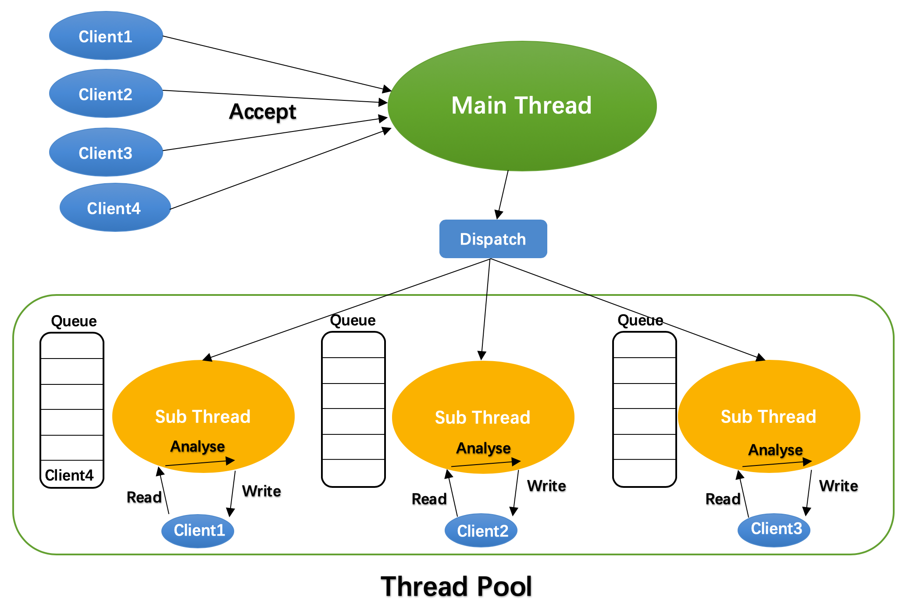

# HTTP Web Server

[](https://opensource.org/licenses/MIT)

## 简介

    - 基于C++的Web服务器，实现了GET请求解析
    - 尚未加入计时器，暂不支持长连接
    - 通过线程池和Epoll I/O多路复用技术实现该Web Server，具备一定的并发能力

[网站主页 www.etzhang.xyz](http://www.etzhang.xyz) (尚未部署)

调试环境：Ubuntu 18.04

部署环境：CentOS 7

工具：cmake, g++4.8.2

最近更新，参考腾讯开源库[libco](https://www.github.com/Tencent/libco.git)的写法，重写了`epoll.h`，识别Apple与FreeBSD，使用`kqueue`重新实现，但MACOSX没有`<sys/eventfd.h>`库的问题尚未解决

## 要点
    - 使用Epoll的ET模式，非阻塞IO
    - 使用多个线程，每个线程持一个epoll描述符对连接进行管理，并通过线程池管理多个线程避免线程重复创建的开销
    - 主线程只向epoll注册Socket监听描述符，负责accept请求，再轮询分配注册到子线程的epoll，由子线程负责HTTP请求的解析与响应
    - 使用智能指针代替裸指针，减少内存泄漏可能性

## 部署
进入项目根目录，运行
```shell
cd build
cmake ..
make
```
完成项目编译，生成可执行进程文件于 `build/server/` 中，运行即可
```shell
./server/HttpServer
```
如遇bind() error，可能是权限问题，使用root权限运行即可
```shell
sudo ./server/HttpServer
```
如果是因为端口被占用或未打开，自行搜索对应系统版本的打开方式即可
## 模型

